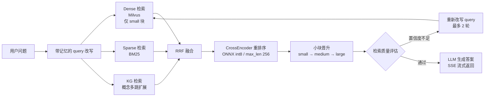

# 架构设计

> 配套阅读：[评估报告](./EVALUATION_REPORT.md)（各项优化的量化收益）、[README](../README.md)

## 总体架构

```mermaid
flowchart TB
    subgraph Frontend["前端 (React + SSE)"]
        UI[聊天界面 / 调试面板]
    end

    subgraph Backend["FastAPI 后端"]
        ChatAPI[Chat API<br/>SSE 流式响应]
        ChatService[ChatService<br/>会话编排]
        MemoryService[MemoryService<br/>滚动摘要 + 长期记忆]
        MainAgent[MainAgent<br/>意图路由 / 并行编排]
        RAGTool[RAGQATool<br/>每子任务独立实例]
        RAGGraph[RAGGraph (LangGraph)<br/>retrieve → evaluate →<br/>rewrite/generate 迭代环]
        Retriever[HybridRetriever<br/>三路召回 + RRF 融合]
        Reranker[CrossEncoder 重排序<br/>ONNX int8 CPU]
        GenLLM[生成 LLM<br/>OpenAI 兼容接口]
    end

    subgraph Storage["存储层"]
        SQLite[(SQLite<br/>用户/文档/消息元数据)]
        Milvus[(Milvus<br/>dense 向量 + 记忆向量)]
        Neo4j[(Neo4j<br/>知识图谱)]
    end

    subgraph Ops["可观测性"]
        OTel[OpenTelemetry]
        Jaeger[Jaeger UI]
    end

    UI -->|fetch / SSE| ChatAPI
    ChatAPI --> ChatService
    ChatService --> MemoryService
    MemoryService -->|query 改写| ChatService
    ChatService --> MainAgent
    MainAgent -->|并行调用| RAGTool
    RAGTool --> RAGGraph
    RAGGraph --> Retriever
    Retriever --> Reranker
    RAGGraph --> GenLLM
    ChatService --> SQLite
    Retriever --> Milvus
    MemoryService --> Milvus
    Retriever -.->|KG 第三路<br/>失败自动回退| Neo4j
    ChatService & Retriever & GenLLM --> OTel --> Jaeger
```

## 检索链路细节



## 关键设计决策

### 1. MainAgent 直连路由，不用 ReAct 循环

早期版本让 LLM 以 ReAct 模式自主决定工具调用，单次决策耗时 10-15 秒。由于本系统工具面很窄（本质上只有知识库问答一类），改为 **LLM 判断意图后直接调用 RAGQATool**：简单问题单次调用，多任务问题并行调用后汇总。

- 收益：端到端延迟从 ~26.5s 降至 ~7.8s（详见评估报告）
- 代价：丧失通用性——如果未来工具数量和类型显著增长，需要重新引入规划层

### 2. 检索质量评估驱动的迭代环（Agentic RAG 核心）

RAGGraph 内置 `evaluate` 节点，从 rerank 分数、RRF 双路命中比例等信号计算检索置信度；置信度不足时**带着失败原因重新改写 query 再检索**（最多 2 轮），而不是直接生成。这让"检索不到"的场景有机会自愈，而不是让 LLM 对着劣质上下文硬答。

### 3. 三层切块，但只检索 small 块 + 按需晋升

文档切成 large(2000)/medium(500)/small(150) 三层，但**向量库中只对 small 做检索**，命中后按共现关系把同父的 small 合并晋升为 medium/large 原文。

- 为什么：小块向量语义集中，召回精度高；但小块上下文太碎，直接给 LLM 效果差
- 收益：相比三层一起检索，避免大块稀释召回，同时保证生成上下文完整

### 4. 知识图谱作为第三路检索，且永不拖垮主链路

Neo4j 存储法律概念/主体/条文图，检索时从问题概念出发做多跳扩展，作为 dense+sparse 之外的第三路召回参与 RRF 融合。

- 设计约束：KG 初始化失败、Neo4j 宕机、查询超时等**任何异常都自动降级为两路检索**，主链路完全无感
- 为什么：法律领域的关联推理（如"试用期→合同期限→解除条件"）是向量检索的弱项

### 5. Reranker 用 ONNX int8 CPU，而不是 GPU/FP32

CrossEncoder 用 Optimum 导出 int8 量化 ONNX 模型，AVX2 指令集跑在 CPU 上，并将每条 pair 的 max_length 从 512 降到 256。

- 为什么：部署环境无 GPU；int8 + 短序列在 CPU 上把重排序从 ~4.2s 压到 ~1.4s，精度损失可忽略（RAGAS 指标无回退）
- 权衡：候选数限制在 10 条以内（CPU 耗时随候选数线性增长）

### 6. 记忆系统：滚动摘要 + 未压缩历史 + 长期记忆，按 token 预算裁剪

会话记忆分三层：较早历史压缩为滚动摘要、近期消息保留原文、跨会话的用户事实抽取为长期记忆向量（Milvus 按 user_id 隔离）。组装上下文时按"改写模型上下文窗口 - 预留输出/RAG token"计算预算，超限则进一步压缩，保证 query 改写永远拿得到完整记忆视角。

### 7. 全链路 OpenTelemetry 追踪

所有关键节点（检索、重排序、LLM 调用、记忆准备）上报 span 到 Jaeger。本文档和评估报告中的每一项延迟数字都来自真实 trace，而不是拍脑袋——这也是能定位"rerank 4 秒""思考模式 16 秒"这类问题的前提。

### 8. Chunk 生命周期治理

文档更新不是简单覆盖：新 chunk 与旧 chunk 做**冲突检测**（高置信度自动作废旧块，低置信度转人工审核），另有冷知识扫描（长期未命中/低分 chunk 归档、到期硬删），避免知识库随时间膨胀劣化。

## 目录结构速览

```text
backend/
  app/
    api/            # FastAPI 路由（chat / documents / auth / admin / kg）
    agent/          # MainAgent 编排器 + RAGQATool
    rag/            # 检索核心：retriever / vector_store / splitter / graph / steps
    knowledge_graph/ # KG 抽取、存储、检索、管理 API
    services/       # chat / memory / document / conflict / cold-knowledge
    core/           # 配置、依赖注入、安全、可观测性
  scripts/          # demo_setup.py 一键种子演示
  tests/            # unit / test_knowledge_graph(testcontainers) / 评估脚本
frontend/           # React + Vite
.github/workflows/  # CI：lint + 单测(覆盖率) + KG 集成测试 + 前端构建
```
